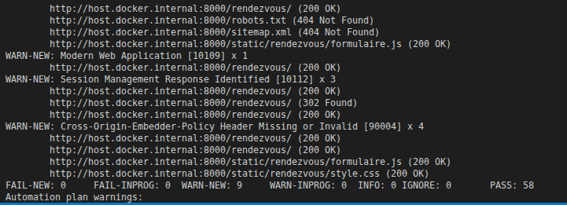

## Partie 4 - Détecter outillé : SAST, DAST, SCA
### DAST - OWASP ZAP
### Résultat du scan ZAP

Le scan DAST avec OWASP ZAP a porté sur 10 URLs et n'a détecté aucune vulnérabilité classée FAIL. En revanche, 9 avertissements ont été relevés, notamment l'absence du flag HttpOnly sur un cookie, l'absence des headers X-Content-Type-Options, CSP, Permissions Policy et Cross-Origin-Embedder-Policy, ainsi que l'exposition d'informations via le header Server. Ces résultats montrent que l'application nécessite encore des mesures de durcissement de la configuration HTTP.