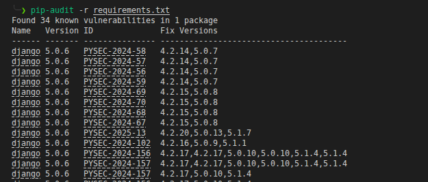

## Partie 4 - Détecter outillé : SAST, DAST, SCA
### SCA - pip-audit
### Résultat de l'analyse SCA
 

Une analyse des dépendances du projet a été réalisée avec **pip-audit** à partir du fichier `requirements.txt`.

Le scan a identifié **34 vulnérabilités connues dans une seule dépendance : Django 5.0.6**. Plusieurs identifiants `PYSEC` et `CVE` sont associés à cette version, et des versions corrigées sont proposées par l'outil.

Ce résultat confirme que la version de Django utilisée dans SunuSanté est obsolète du point de vue de la sécurité et constitue un risque important pour l'application.

### Action corrective

La dépendance Django doit être mise à niveau vers une **version actuellement supportée et corrigée**, puis les tests fonctionnels et de sécurité doivent être relancés afin de vérifier que la mise à jour n'introduit pas de régression.

Une nouvelle exécution de `pip-audit` sera effectuée après la mise à jour afin de vérifier que les vulnérabilités connues ont été supprimées.

Cette analyse illustre le rôle du **SCA dans le SSDLC** : identifier les vulnérabilités présentes dans les dépendances avant leur mise en production.

### Apres correctif de la version de Django en 5.2.17

aucune vulnérabilité(CVE) n'a été détectée